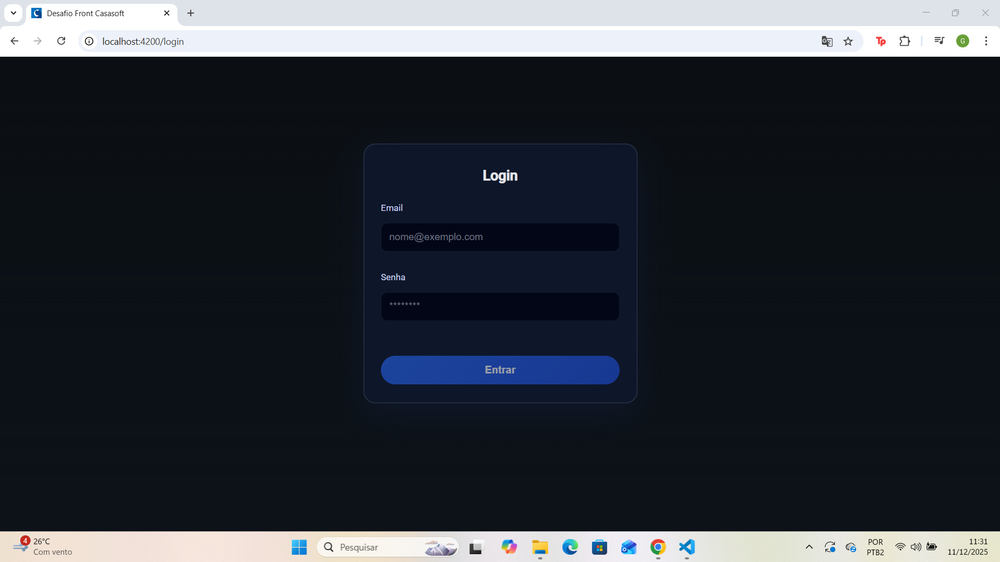
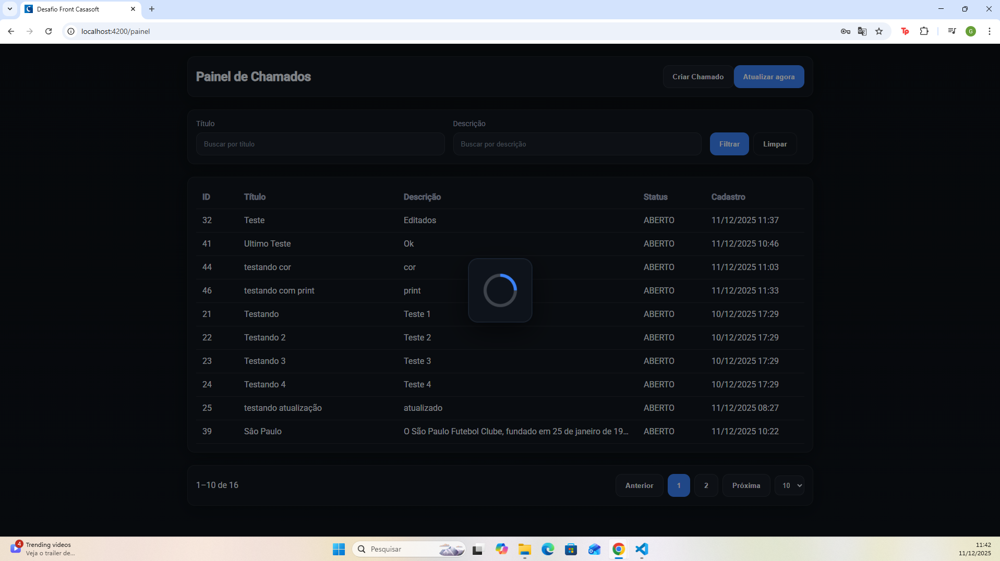
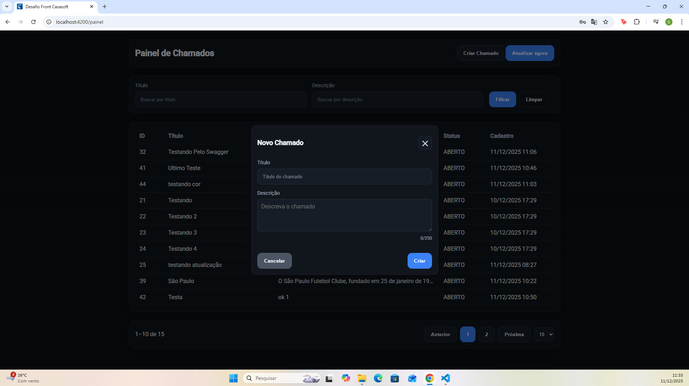
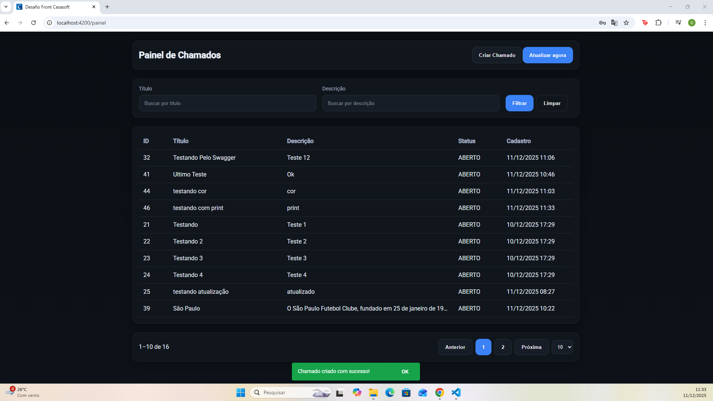
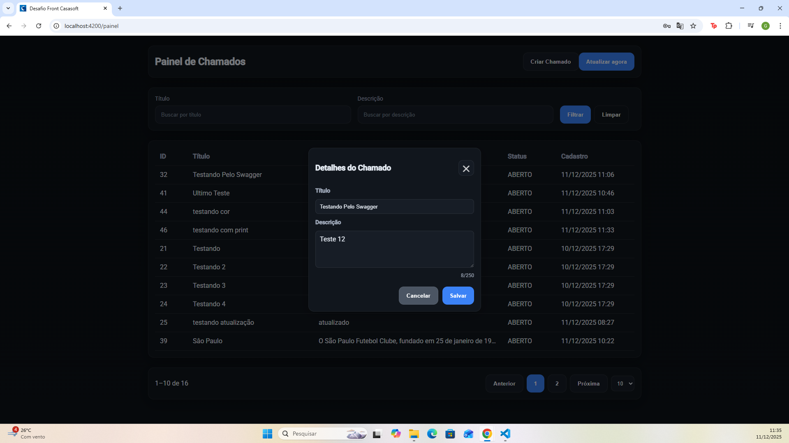
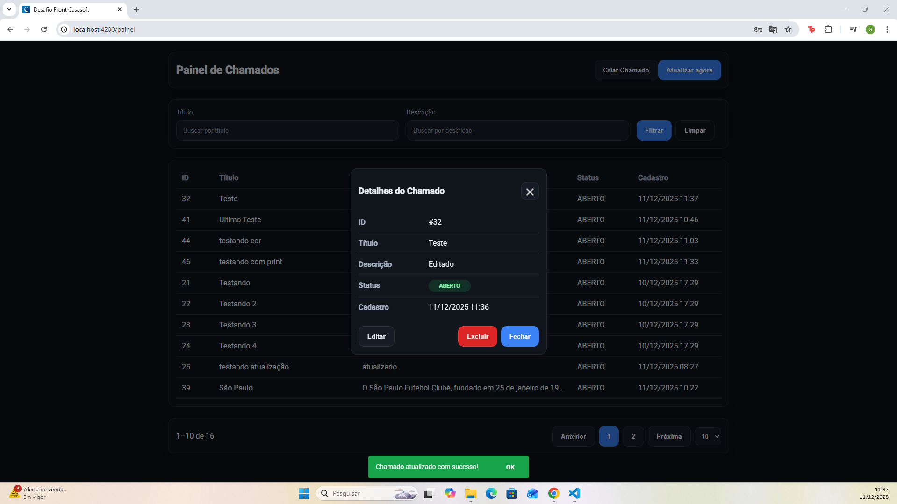
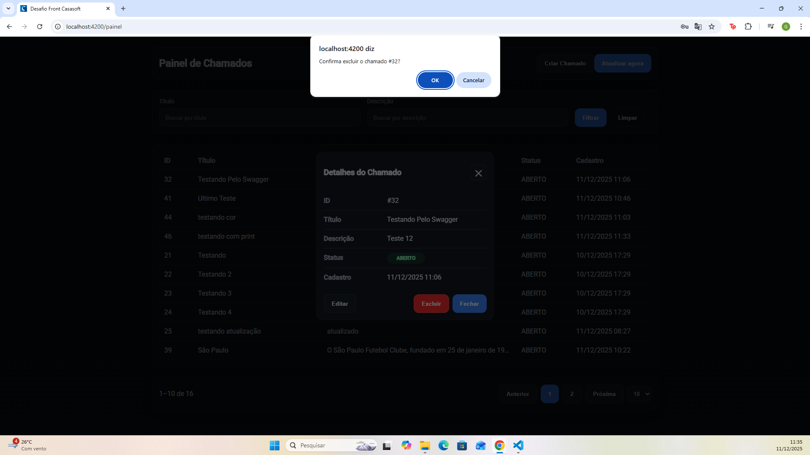
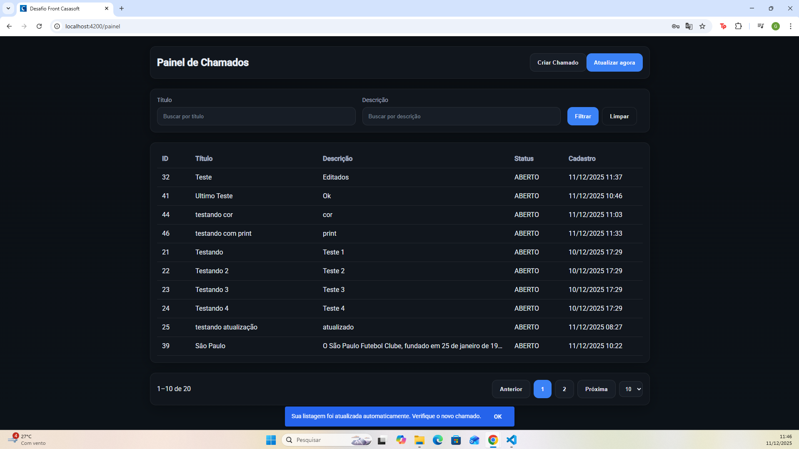

# 🎯 Desafio Front-End — Casasoft

Este repositório contém a solução desenvolvida para o desafio técnico da Casasoft, utilizando **Angular 17 (Standalone Components)**, integração com APIs REST e atualização em tempo real através de **SignalR**.

A aplicação simula um painel de chamados, onde o usuário autenticado pode realizar operações CRUD, além de visualizar atualizações automáticas enviadas por outros usuários/sistemas.

---

## 📚 Sumário

1. [Visão Geral](#visão-geral)  
2. [Funcionalidades Implementadas](#funcionalidades-implementadas)  
3. [Tecnologias Utilizadas](#tecnologias-utilizadas)  
4. [Como Rodar o Projeto](#como-rodar-o-projeto)  
5. [Credenciais de Acesso](#credenciais-de-acesso)  
6. [Estrutura de Pastas](#estrutura-de-pastas)  
7. [Arquitetura e Decisões Técnicas](#arquitetura-e-decisões-técnicas)  
8. [Detalhamento dos Fluxos](#detalhamento-dos-fluxos)  
9. [Atualizações Automáticas via SignalR](#atualizações-automáticas-via-signalr)  
10. [Feedback ao Usuário (Snackbars)](#feedback-ao-usuário-snackbars)  
11. [Build de Produção](#build-de-produção)  
12. [Prints da Aplicação](#prints-da-aplicação)  
13. [Possíveis Melhorias Futuras](#possíveis-melhorias-futuras)  
14. [Autor](#autor)

---

## 🔎 Visão Geral

A aplicação fornece um painel administrativo para gerenciar chamados, contendo:

- Login  
- Listagem paginada  
- Filtragem  
- Criação de chamados  
- Edição e exclusão  
- Visualização detalhada  
- Atualização automática via SignalR  
- Feedback visual consistente com snackbars personalizadas  

O objetivo foi criar uma aplicação moderna, leve, organizada e com comportamento responsivo.

---

## ⚙️ Funcionalidades Implementadas

### 🔐 Autenticação
- Login com persistência do token no `localStorage`
- Redirecionamento automático para o painel quando autenticado

### 📝 Chamados
| Ação | Implementado |
|------|--------------|
| Listar | ✔ |
| Filtrar por título | ✔ |
| Filtrar por descrição | ✔ |
| Criar chamado | ✔ |
| Editar chamado | ✔ |
| Excluir chamado | ✔ |
| Visualizar detalhes | ✔ |
| Paginação | ✔ |

### 🔔 Atualizações automáticas
- Quando outro usuário cria/edita/exclui um chamado, o sistema recebe um evento SignalR e atualiza automaticamente a tabela.

### 🎨 Feedback ao usuário
- Snackbars **verdes** para ações bem-sucedidas  
- Snackbars **vermelhas** para erros  
- Snackbar **automática** quando a atualização vem via SignalR  

---

## 💻 Tecnologias Utilizadas

| Tecnologia | Uso |
|-----------|-----|
| **Angular 17** | Framework principal |
| **Standalone Components** | Organização leve sem módulos |
| **RxJS (BehaviorSubject/Subject)** | Gerenciamento reativo de estado |
| **Angular Material (MatSnackBar e MatTooltip)** | Feedback visual e tooltips |
| **SignalR (WebSockets)** | Atualização em tempo real |
| **SCSS** | Estilização customizada |
| **Vercel** | Deploy da aplicação |

---

## 🚀 Como Rodar o Projeto

### 1️⃣ Instalar dependências
```bash
npm install
```

### 2️⃣ Rodar a aplicação
```bash
ng serve
```

Acesse:  
👉 [http://localhost:4200/](http://localhost:4200/)  

A aplicação recarrega automaticamente ao salvar alterações.

---

## 🔐 Credenciais de Acesso
```graphql
Login: teste@casasoft.com.br  
Senha: teste#1234
```

---

## 📁 Estrutura de Pastas (Resumo)
```bash
src/
 ├── app/
 │    ├── pages/
 │    │     ├── login/
 │    │     └── painel/
 │    ├── services/
 │    │     ├── auth.service.ts
 │    │     ├── chamado.service.ts
 │    │     └── signalr.service.ts
 │    ├── guards/
 │    └── shared/
 │           └── loading-overlay/
 ├── environments/
 └── assets/
```

---

## 🏗 Arquitetura e Decisões Técnicas

### ✔ Standalone Components
Proporciona:
- Carregamento mais rápido  
- Menos dependência de módulos  
- Estrutura limpa e moderna  

### ✔ Estado global via BehaviorSubject
O serviço `ChamadoService` gerencia a lista usando:
```ts
BehaviorSubject<PesquisaState>
```
Isso permite que:
- Componentes recebam atualizações automaticamente  
- Paginação / filtro / SignalR compartilhem o mesmo estado  

### ✔ Separação de responsabilidades
| Serviço | Responsabilidade |
|----------|------------------|
| `AuthService` | Login, tokens, autenticação |
| `ChamadoService` | CRUD + paginação + refresh |
| `SignalRService` | Conexão WebSocket |

### ✔ Interceptação de mensagens automáticas
O backend dispara um evento SignalR → o front recarrega a tabela → exibe snackbar aviso.  
Operações manuais não disparam snackbar acidentalmente (prevenção implementada).

### ✔ Snackbars customizadas
```ts
panelClass: ['snackbar-success']  
panelClass: ['snackbar-error']
panelClass: ['snackbar-auto']
```
Com estilos sobrescritos do Angular Material para feedback visual padronizado.

---

## 🔄 Detalhamento dos Fluxos

### 🔐 1. Login
- Chamada ao endpoint de autenticação  
- Em caso de erro → snackbar vermelha  
- Em caso de sucesso → token salvo + redirecionamento

### 📄 2. Listagem + Filtro
- Dados carregados no `ngOnInit`  
- Filtro 
- Paginação ajusta faixa exibida (ex.: “1–10 de 43”)

### ➕ 3. Criação de Chamado
- Modal com validações  
- Envio do timestamp automático  
- Snackbar: “Chamado criado com sucesso!”

### ✏ 4. Edição
- Preenchimento automático  
- Validação de limite de caracteres  
- Snackbar: “Atualizado com sucesso!”

### 🗑 5. Exclusão
- Confirmação nativa  
- Snackbar: “Excluído com sucesso!”

---

## 🔔 Atualizações Automáticas via SignalR
Fluxo:
1. Backend envia evento `"BroadcastMessage"`  
2. Front recebe via `SignalRService`  
3. Front chama:
```ts
chamados.refresh('signalr')
```
4. Serviço dispara:
```ts
autoUpdate$.next()
```
5. Painel exibe snackbar:
```
"Sua listagem foi atualizada automaticamente. Verifique o novo chamado."
```

Comportamento colaborativo em tempo real.

---

## 🎨 Feedback ao Usuário (Snackbars)

**Exemplo — sucesso**
```ts
this.snack.open('Criado com sucesso!', 'OK', {
  duration: 3000,
  panelClass: ['snackbar-success']
});
```

**Exemplo — erro**
```ts
this.snack.open('Login inválido', 'Fechar', {
  duration: 4000,
  panelClass: ['snackbar-error']
});
```

**Exemplo — atualização automática**
```ts
panelClass: ['snackbar-auto']
```

Cores sobrescritas globalmente em SCSS.

---

## 🏭 Build de Produção
Gerar a versão otimizada:
```bash
ng build
```

Arquivos finais:
```bash
dist/desafio-front-casasoft/
```

---

## 🖼 Prints da Aplicação

| Fluxo | Imagem |
|--------|--------|
| Login |  |
| Lista |  |
| Carregando |  |
| Novo chamado |  |
| Criado com sucesso |  |
| Detalhes |  |
| Editando |  |
| Editado com sucesso |  |
| Exclusão |  |
| Filtro |  |
| Filtro |  |
| Atualização automática |  |

---

## 🚀 Possíveis Melhorias Futuras

- Implementar interceptors para padronizar erros HTTP  
- Criar tema custom Angular Material  
- Internacionalização (i18n)  
- Testes unitários com Vitest/Jest  
- Testes e2e com Cypress  
- Virtual scroll para grandes volumes  
- Skeleton loaders mais sofisticados  

---

## 👨‍💻 Autor

**Gustavo Celestino de Lima**  
🔗 [GitHub](https://github.com/gucelestinodev)  
🔗 [LinkedIn](https://linkedin.com/in/gustavoclima23/)
